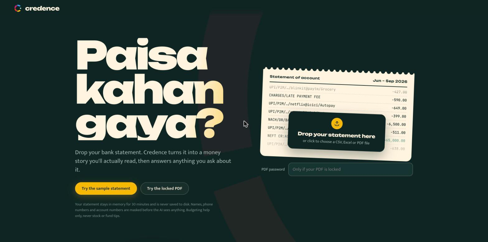
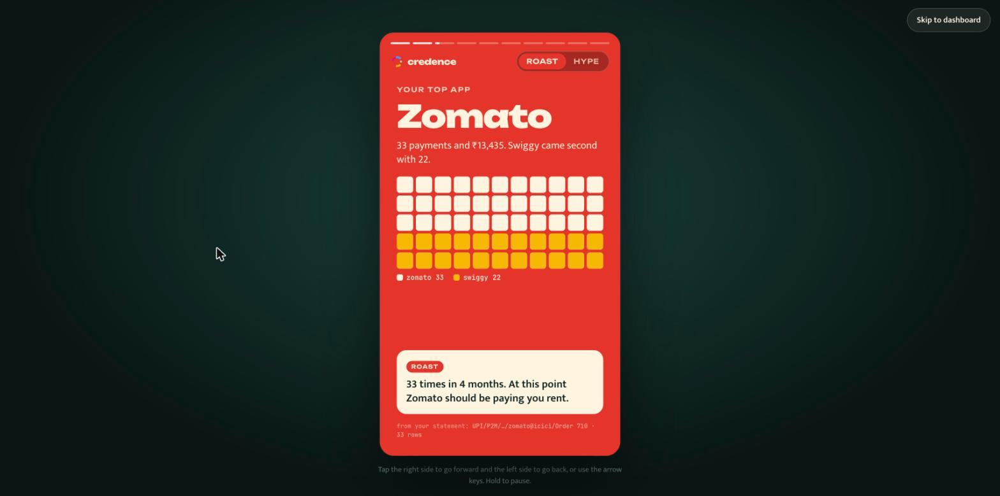
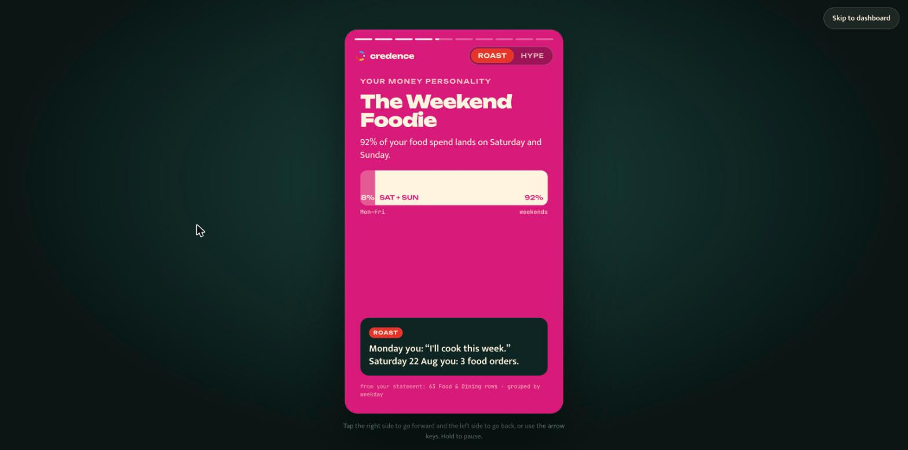
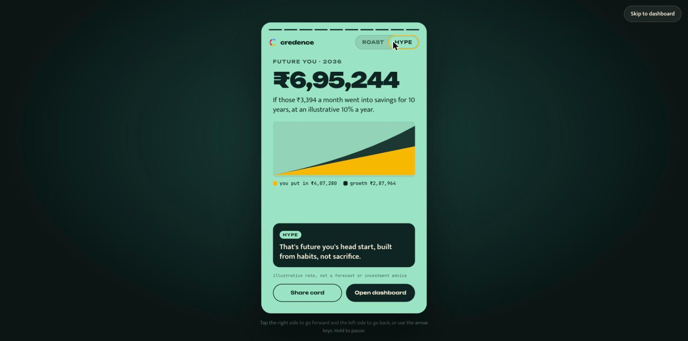
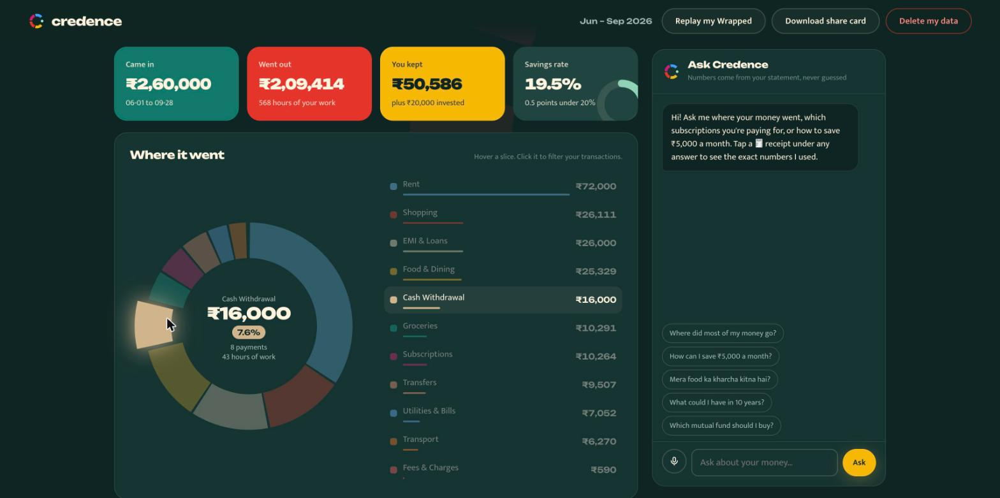

# Credence — your bank statement, told like a story

**Paisa kahan gaya?** Drop an Indian bank statement (CSV, Excel or a password-protected PDF) and Credence turns it into a Spotify-Wrapped-style money story in roast or hype mode, then an interactive dashboard and a chat advisor whose every number is checked against your own transactions.

**Live:** https://credence-wine.vercel.app



## What it does
| | |
|---|---|
| **Money Wrapped** | 10 swipeable cards built from your statement: the big picture, your top app, spending in hours of your life, your money personality, the month things went sideways, the ghost subscription, the friend ledger, what you can win back, and future you. Roast or hype mode; the AI writes the jokes, code writes the numbers. Download it as a 1080×1920 share card. |
| **Hours of your life** | Every rupee figure can be read as hours of your work (income ÷ 176 working hours a month). "₹22,552 on delivery" becomes "61 hours". |
| **Interactive dashboard** | Category donut (hover to pop a slice, click to filter transactions), month-by-month needs/wants bars, 50/30/20 check, ranked saving tips, what-if sliders, goal planner, Future You compounding chart, friend ledger, and a transaction table where fixing one category fixes every matching row. |
| **Grounded chat** | Ask in English or Hinglish, typed or by voice. The model calls 13 deterministic tools; each answer shows 🧾 receipts and a live **"numbers verified"** badge that checks every ₹ amount and % against the tool results. |
| **Built for India** | Reads UPI / NEFT / IMPS / NACH / ATM narrations from HDFC, SBI and ICICI style layouts, lakh formatting, password-protected e-statements. |
| **Privacy and compliance** | In-memory only (30 min), names, phones and account numbers masked before the AI sees anything, one-click delete. Budgeting help only: investment questions get a one-line pointer to a SEBI-registered adviser. |

<p>
  
</p>



## Quickstart
```bash
python3 -m venv .venv && .venv/bin/pip install -r requirements.txt
cp .env.example .env          # add GROQ_API_KEY (free at console.groq.com) for chat and AI captions
.venv/bin/uvicorn app.main:app --port 8000      # open http://localhost:8000
```
Without a key, everything except the chat and the AI-written captions still works (the story uses built-in captions).

Samples: **Try the sample statement** (HDFC-style CSV), **Try the locked PDF** (password `kharcha123`), or **Ananya from Bengaluru** (Axis-style CSV, a different person and habits). Every number is computed from the file; nothing on the cards is hardcoded.

Works on Python 3.9+ (tested on 3.9.6 and 3.12).

**Deploy:** deployed on Vercel (`vercel.json` + `index.py`; `vercel deploy --prod`, env var `GROQ_API_KEY`). The server is stateless across instances: after upload the page keeps a compressed copy of the processed statement in memory (never in storage) and sends it with each request, so any serverless instance can answer; each instance caches it for 30 minutes. Render also works: *New → Blueprint* → pick this repo; `render.yaml` sets everything up. Elsewhere: start command `uvicorn app.main:app --host 0.0.0.0 --port $PORT`. Groq's free tier allows 8k tokens a minute and 200k a day per model; use a Dev-tier key for a public demo.

## Checks
```bash
.venv/bin/python tests/test_core.py     # 18 offline checks: parsing, categories, analytics, story, grounding, chat loop
.venv/bin/python eval/run_eval.py       # 25 live questions against the model; writes eval/results.md (needs the key)
.venv/bin/python scripts/make_sample.py # regenerate data/samples (seeded)
```

## How it works
```
statement ──▶ ingest.py ──▶ categorize.py ──▶ analytics.py ──┬──▶ wrapped.py ──▶ story cards (+ AI captions, number-checked)
 CSV/XLSX/PDF   normalise     UPI parser +      deterministic  │
                columns       merchant rules +   "semantic      ├──▶ dashboard (/overview, /future, /simulate, /goal)
                              LLM fallback       layer"         │
                                                                └──▶ chat.py ──▶ Groq gpt-oss-120b tool calls ──▶ grounding.py badge
```
- **Numbers from code, words from the model.** The LLM never sees raw rows and never does arithmetic we trust. It picks tools; `grounding.py` flags any ₹ figure or % that isn't in a tool result.
- **AI captions are checked too.** A roast line is dropped if it contains a number that isn't on its card.
- **Resilient on the free tier.** Groq's free tier allows 8k tokens/minute, so the chat trims its context, drops evidence ids from what the model sees, and switches to `gpt-oss-20b` (separate quota) on a rate limit.

| File | Role |
|---|---|
| `app/ingest.py` | CSV / XLSX / PDF (with password) to one normalised table; header and column-synonym detection |
| `app/categorize.py` | Narration parser, 160-keyword merchant dictionary, rail rules, enum-constrained LLM fallback, user overrides |
| `app/analytics.py` | Overview, breakdowns, recurring payments, anomalies, 8 insight generators, what-if, goals, quick wins, Future You, friend ledger |
| `app/wrapped.py` | Builds the story cards and the number-checked AI captions |
| `app/chat.py` | PII redaction, tool-use loop with streaming, retries and model fallback |
| `app/grounding.py` | The per-answer number check shared by the UI and the eval |
| `app/static/` | `index.html`, `style.css`, `app.js` (dashboard + chat), `wrapped.js` (story + share card), `logo.svg` |

## 3-minute demo script
1. **Hook (15 s):** "Household savings hit a 47-year low while UPI clears 24 billion payments a month. Nobody can read their statement."
2. **Upload (20 s):** click *Try the locked PDF*. The loader shows real statement lines being decoded into categories.
3. **Wrapped (60 s):** Zomato 33 times → 61 hours of work → *The Weekend Foodie* → August plot twist → ghost cultfit subscription. Flip to **Hype** mid-story. End on *Future you: ₹6,95,244 by 2036*. Hit *Share card*.
4. **Dashboard (40 s):** hover the donut, click Food & Dining to filter, drag a what-if slider, change Future You to 20 years.
5. **Chat (40 s):** "How can I save ₹5,000 a month?" → open a 🧾 receipt → point at the ✓ verified badge. Ask "Mera food ka kharcha kitna hai?" (Hinglish). Ask "Which mutual fund should I buy?" → SEBI refusal.
6. **Close (5 s):** *Delete my data*.

Budgeting help only. Credence does not recommend securities.
