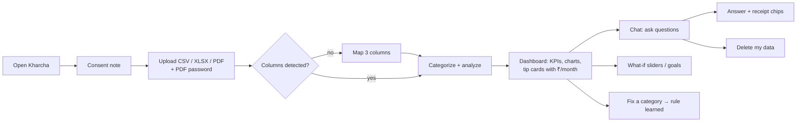
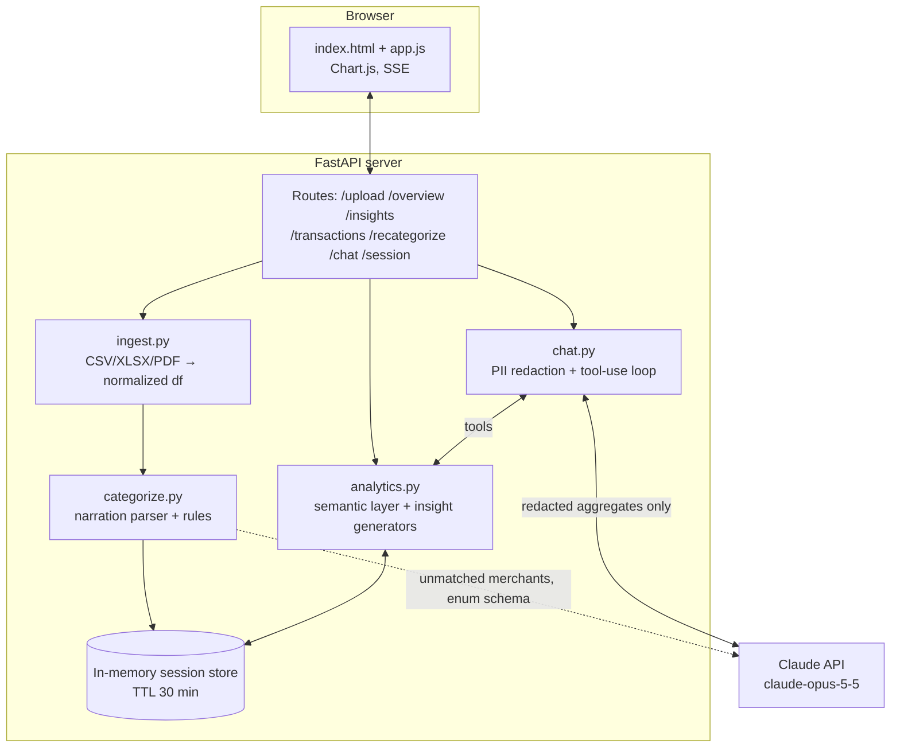
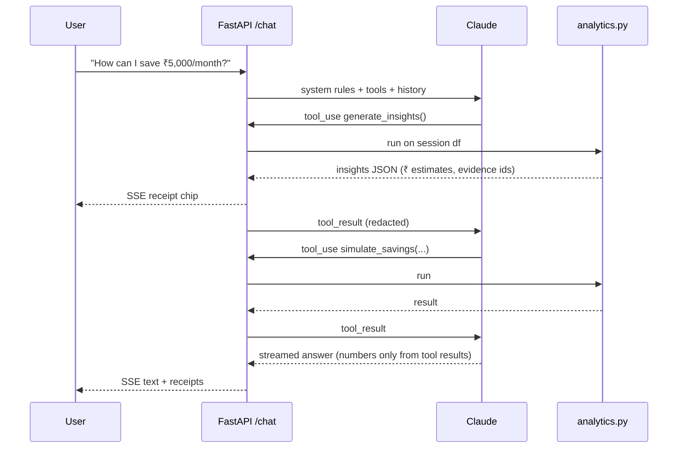

# Presentation Reference — Kharcha: AI Personal Finance Advisor (PS-2)

> **Living document.** Update it at the end of every build phase (see `plan.md`). Items marked `[TBD Px]` get filled in by phase Px.
> Each numbered section maps to one or two slides.

## Build log
| Date | Phase | What changed in this doc |
|---|---|---|
| 2026-10-07 | Research | Initial content from `research.md`, architecture and wireframes drafted |

---

## 1. Problem Analysis

**One-liner:** Indians are spending more digitally than ever, but saving less than they have in decades, and their bank statements are unreadable.

**Key facts (slide-ready)**
- 📉 **Net household financial savings fell to 5.3% of GDP in FY23, a 47-year low.** Household liabilities grew ~30% a year against ~10% for savings (FY21–23). [1][2]
- 🧠 **Only 27% of Indian adults are financially literate** (NCFE 2019). [4]
- 📱 **24.5 billion UPI transactions in a single month** (Aug 2026). Lots of small payments that nobody tracks. [6]
- 🔁 **More than half of subscribers pay for subscriptions they don't use.** [9]

**Why existing options fail**
- Bank statements are cryptic: `UPI/P2M/412345678901/swiggy@ybl/ORDER-891`.
- Bank-app "insights" are coarse. Spreadsheets need effort and literacy.
- Global AI coaches (Cleo, Copilot, Monarch) are US/UK-only and do not understand UPI or Indian banks. [13][15]
- Indian trackers need SMS or account permissions and often push financial products.
- Generic LLM chatbots **make up numbers** when reading tables. [26]

**Target user:** a young earning Indian (students with stipends, first-jobbers, ₹20k–₹1.5L/month) who pays through UPI and wants to save but doesn't know where the money goes.

**Problem statement in our words:** *"I know I'm overspending, but I can't tell on what, and I don't know what to change."*

---

## 2. Proposed Solution & Key Features

**Kharcha:** upload your bank statement, ask anything about your money, and get specific saving tips in rupees, all backed by your own transactions.

**Key features**
1. **Upload-and-ask, zero setup:** CSV, XLSX or **password-protected PDF** from any major Indian bank. No account linking, no SMS access, no sign-up.
2. **Built for India:** parses UPI, NEFT, IMPS, NACH and ATM narrations and recognizes Indian merchants (Swiggy, Zomato, Blinkit, Rapido, IRCTC, Jio…). Shows ₹ in lakh formatting and understands Hinglish.
3. **Conversational advisor:** "Where did my money go?", "How much on food delivery?", "How can I save ₹5,000 a month?"
4. **Grounded answers with receipts:** every number links to the computed data behind it. No made-up figures.
5. **Automatic saving insights:** 50/30/20 health check, **subscription audit** (finds unused ones), small-spend leaks, category spikes, weekend effect, avoidable fees, emergency-fund runway. Each one comes with a ₹/month saving estimate.
6. **What-if simulator and goal planner:** "Cut food delivery by 30%, and here's your yearly saving." `[TBD P6]`
7. **Learns from corrections:** fix one category and every similar transaction is fixed too.
8. **Privacy first:** processed in memory, PII masked before the AI sees it, one-click delete.
9. **Responsible by design:** budgeting guidance only, never stock or mutual-fund tips (SEBI-compliant stance).

**Feature status**
| Feature | Status |
|---|---|
| Ingestion (CSV/XLSX/PDF) | `[TBD P1]` |
| Hybrid categorization | `[TBD P2]` |
| Insights engine | `[TBD P3]` |
| Grounded chat | `[TBD P4]` |
| Web UI | `[TBD P5]` |
| What-if / goals / eval | `[TBD P6]` |

---

## 3. Technical Approach & Innovation

### Stack
Python · FastAPI · pandas · pdfplumber · Anthropic Claude API (`claude-opus-5-5`, tool use + structured outputs + streaming) · vanilla JS + Chart.js · Server-Sent Events.

### Pipeline
1. **Ingest:** detect the header row and map column synonyms across bank layouts, normalize to `date, narration, amount(±), balance`. PDFs go through pdfplumber with the password. `[TBD P1: banks/layouts verified]`
2. **Categorize (hybrid, 3 tiers):** rules (merchant/VPA dictionary + rail rules) → LLM fallback limited to a **fixed category enum** through structured outputs → user corrections become rules. `[TBD P2: rule-only accuracy X%, hybrid Y%]`
3. **Analyze:** a deterministic "semantic layer" of 8 analytics functions plus 8 insight generators. `[TBD P3]`
4. **Converse:** Claude calls the analytics functions as tools and explains the results. PII is redacted first, a guardrail system prompt applies, and responses stream. `[TBD P4]`

### Innovations (what makes this more than a ChatGPT wrapper)
| Innovation | Why it matters | Evidence |
|---|---|---|
| **"Numbers from code, words from the LLM"**: tools-only arithmetic plus receipt chips | LLMs make up numbers on tables. A semantic layer raised accuracy from about 45–50% to about 68% in published tests [26] | Our grounding rate: `[TBD P6]` |
| **Hybrid categorizer with an enum-constrained LLM** | Pure LLM reached about 66% in one benchmark, hybrid systems about 98% [22][23]. The enum prevents invented categories | Ours: rule-only `[TBD]`%, hybrid `[TBD]`% |
| **India-native narration parsing** (UPI VPA, NACH, IMPS) | Global tools can't read Indian statements | `[TBD P2]` |
| **Insights → ₹ saving estimate → LLM phrasing** | Specific, personal nudges change behavior. Generic advice doesn't [11] | `[TBD P3]` |
| **Privacy by design** (in-memory, redaction, aggregates-only) | Matches the DPDP Rules 2025 consent and minimization principles [28][29] | — |
| **Regulatory guardrail** (no securities advice) | SEBI holds AI advice to the adviser's accountability [31][32] | Refusal compliance `[TBD P6]` |
| **Cost per chat turn** | About $0.036 on Opus 5.5 before caching (estimate) | Measured: `[TBD P6]` |

---

## 4. Impact & Future Scope

### Impact
- **Individual:** turns an unreadable statement into a clear picture in under a minute, plus 3–5 concrete actions worth `₹[TBD P6]`/month on our sample persona.
- **Financial literacy:** teaches the ideas (50/30/20, emergency fund, subscription hygiene) *using the user's own data*, which is the strongest way to learn.
- **Scale:** relevant to anyone with a bank account and UPI. That covers hundreds of millions of people, since UPI handles over 24 billion transactions a month [6].
- **Trust:** grounded numbers, no product pushing, and no data kept.

### Measured results (fill from eval)
| Metric | Target | Actual |
|---|---|---|
| Categorization accuracy (hybrid) | ≥ 95% | `[TBD P2]` |
| Chat answer accuracy | ≥ 90% | `[TBD P6]` |
| Grounding rate (₹ figures traceable to tools) | ≥ 98% | `[TBD P6]` |
| Investment-advice refusal compliance | 100% | `[TBD P6]` |
| Upload → dashboard time | < 5 s | `[TBD P5]` |
| Cost per chat turn | < $0.05 | `[TBD P6]` |

### Future scope
1. **Account Aggregator integration:** consent-based live data from 179 FIPs and 2.88 billion enabled accounts, with no uploads [33]. Requires FIU onboarding.
2. **Multi-month memory and goals tracking**, with monthly "money check-in" nudges.
3. **Voice in Indian languages** (Hindi, Marathi, Tamil…).
4. **Credit card statements and loan optimizer** (prepay vs invest, EMI restructuring, framed as general principles).
5. **Bank / NBFC white-label:** banks embed Kharcha in their apps as a customer-wellness feature.
6. **Anonymized cohort benchmarks:** "people like you spend X% on food".

---

## 5. Supporting Information

### 5.1 User workflow


### 5.2 System architecture


### 5.3 Chat request sequence (grounding)


### 5.4 Wireframes (to be replaced by real screenshots in P5)
```
┌──────────────────────────── Kharcha ────────────────────────────┐
│                                                                 │
│        ┌─────────────────────────────────────────────┐          │
│        │   ⬆  Drop your bank statement here          │          │
│        │      CSV · XLSX · PDF                       │          │
│        │   PDF password: [__________]                │          │
│        └─────────────────────────────────────────────┘          │
│        [ Try a sample statement ]                               │
│   🔒 Processed in memory only. Never stored. Delete anytime.    │
└─────────────────────────────────────────────────────────────────┘

┌─────────────── Dashboard ────────────────┬──────── Chat ─────────┐
│ Income ₹65,000 │ Spent ₹52,310 │ Saved 20%│ 🤖 Hi! Ask me about   │
├──────────────────────────────────────────┤ your spending.        │
│  [ donut: categories ]  [ bars: months ] │                       │
│  50/30/20: ████████▒▒▒▒░░  58/34/8       │ 👤 How can I save     │
├──────────────────────────────────────────┤    ₹5,000/month?      │
│ 💡 Unused gym membership   ₹1,499/mo  ▶  │ 🤖 Three changes…     │
│ 💡 Weekday food delivery   ₹2,900/mo  ▶  │  [receipt] [receipt]  │
│ 💡 Late-payment fee        ₹590       ▶  │                       │
├──────────────────────────────────────────┤ [Where did it go?]    │
│ Date   Merchant   Amount  Category [▼]   │ [Subscriptions?]      │
│ 03 Sep Swiggy     -₹412   Food     [▼]   │ [________________] ➤  │
└──────────────────────────────────────────┴───────────────────────┘
```
Real screenshots: `[TBD P5: docs/screens/*.png]`

### 5.5 Research summary
- Full research with 34 cited sources: `research.md`.
- Datasets: synthetic statements in 2 Indian bank layouts plus a password-protected PDF, generated with ground truth for evaluation. `[TBD P0: row counts, persona details]`
- Evaluation method: about 25 questions scored on accuracy, grounding rate and refusal compliance. `[TBD P6]`

### 5.6 References
1. NextIAS — India household savings fall (2025). https://www.nextias.com/ca/current-affairs/07-07-2025/india-household-savings-fall
2. Policy Circle — India's household savings crisis. https://www.policycircle.org/?p=36841
3. Grant Thornton Bharat — Falling household savings. https://www.grantthornton.in/en/insights/articles/how-to-address-indias-falling-household-savings
4. NCFE — Financial Literacy & Inclusion Survey 2019. https://old.ncfe.org.in/images/pdfs/reports/NCFE%202019_Final_Report.pdf
5. Moneylife — 76% Indian adults financially illiterate. https://www.moneylife.in/article/76-percentage-indian-adults-financially-illiterate-survey/44508.html
6. StartupTalky — UPI Aug 2026 record. https://startuptalky.com/india-upi-transactions-august-2026-record-volume/
9. YouGov — Subscription graveyard. https://business.yougov.com/content/50030-subscription-graveyard-how-many-unused-subscriptions-are-consumers-currently-paying-for
11. Bank of England (Ruan) — Saving nudges. https://www.bankofengland.co.uk/-/media/boe/files/events/2023/june/t-ruan-slides.pdf
13. Penny Hoarder — Cleo review 2026. https://www.thepennyhoarder.com/budgeting/cleo-app-review/
15. Dupple — Best AI personal finance tools 2026. https://dupple.com/learn/best-ai-personal-finance-tools
16. Terra Insight — Indian narration patterns. https://www.terra-insight.com/insights/bank-statement-narration-patterns-india
22. Digits — LLMs vs purpose-built categorization. https://digits.com/_assets/downloads/beyond-the-hype-evaluating-llms-vs-digits-agl.pdf
23. transaction-ai — Benchmarks. https://transaction-ai.readthedocs.io/en/latest/BENCHMARKS/
26. arXiv 2604.25149 — Semantic layers for reliable LLM analytics. https://arxiv.org/abs/2604.25149
28. Mondaq — DPDP Rules 2025 notified. https://www.mondaq.com/india/data-protection/1708164/digital-personal-data-protection-rules-2025-notified
29. SCC Online — DPDP Rules key highlights. https://www.scconline.com/blog/post/2025/12/26/digital-personal-data-protection-rules-2025-key-highlights/
31. Outlook Money — SEBI vs finfluencers. https://www.outlookmoney.com/news/sebi-vs-finfluencers-market-regulator-introduces-new-rule-to-curb-spread-of-investment-advice-from-unregistered-advisories
32. Mondaq — SEBI digital compliance 2026. https://webiis10.mondaq.com/india/securities/1759228/sebis-new-digital-compliance-rules-what-investment-advisers-must-know-in-2026
33. Dept. of Financial Services — Account Aggregator. https://financialservices.gov.in/account-aggregator-framework

(Numbering matches `research.md` §7.)
