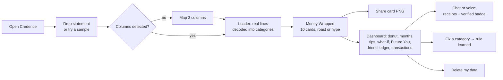
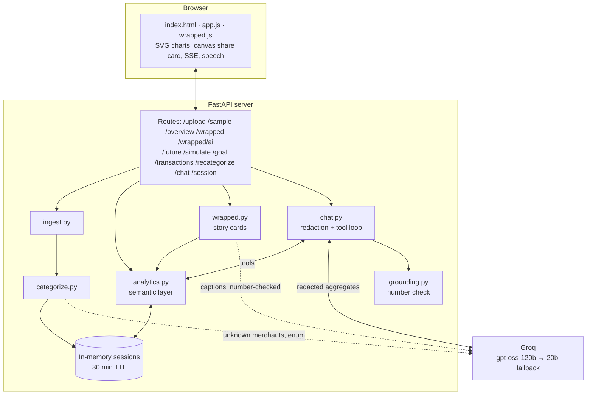
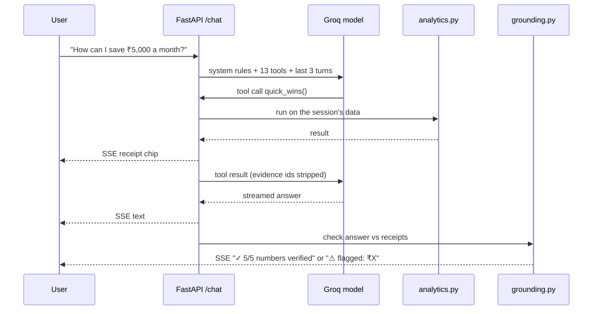

# Presentation Reference — Credence (PS-2: Personal Finance Advisor Chatbot)

> Source material for the deck and the demo video. Each numbered section maps to one or two slides; §6 is a ready slide outline, §7 the video script, §8 judge Q&A. Every number here was measured on this build unless marked otherwise. Screenshots live in `docs/screens/`.

**One-liner:** *Credence turns an unreadable Indian bank statement into a Spotify-Wrapped-style money story, then answers any question about it with numbers that are checked against your own transactions.*

**Tagline:** Paisa kahan gaya?

## Build log
| Date | What changed |
|---|---|
| 2026-10-07 | Research, synthetic statements with ground truth, ingestion, hybrid categorizer, analytics, grounded chat, first UI (as "Kharcha") |
| 2026-10-08 | Renamed **Credence**; new brand and logo; Money Wrapped story with roast/hype and AI captions; hours-of-work framing; Future You; friend ledger; share card; voice input; live "numbers verified" badge; peacock-green redesign with interactive SVG charts; Groq free-tier resilience (fallback model, trimmed context, retries); ICICI layout; live eval and unseen-merchant categorization benchmark |

---

## 1. Problem Analysis

**Indians are spending more digitally than ever, saving less than in decades, and can't read their own bank statements.**

- 📉 **Net household financial savings fell to 5.3% of GDP in FY23, a 47-year low.** Household liabilities grew ~30% a year against ~10% for savings (FY21–23). [1][2]
- 🧠 **Only 27% of Indian adults are financially literate** (NCFE 2019). [4]
- 📱 **24.5 billion UPI payments in one month** (Aug 2026). Dozens of ₹50–₹500 payments a week that nobody adds up. [6]
- 🔁 **More than half of subscribers pay for at least one subscription they don't use.** [9]

**Why existing options fail**
- Statements are cryptic: `UPI/P2M/412345678901/swiggy@ybl/ORDER-891`.
- Bank-app "insights" are coarse; spreadsheets need effort and literacy, which is the very thing missing.
- Global AI coaches (Cleo, Copilot, Monarch) are US/UK-only and don't understand UPI or Indian banks. [13][15]
- Indian trackers want SMS or account access and often push financial products.
- Generic LLM chatbots **make up numbers** when they read tables. [26]
- Dashboards don't change behaviour. **Nobody screenshots a pie chart.** People do share a Wrapped.

**Target user:** a young earning Indian (students with stipends, first-jobbers, ₹20k–₹1.5L a month) who pays by UPI and wants to save but doesn't know where the money goes.

**In their words:** *"I know I'm overspending, but I can't tell on what, and I don't know what to change."*

---

## 2. Proposed Solution & Key Features

**Credence:** drop your statement, watch your money Wrapped, then explore and ask. Every number comes from your transactions.

### 2.1 The hero: Money Wrapped (screens 03–06)
Ten full-screen cards built from the statement in about 0.04 s of server time:

| # | Card | Sample persona result |
|---|---|---|
| 1 | Paisa kahan gaya? | 4 months, 179 payments, ₹2,09,414 spent |
| 2 | The big picture | ₹2,60,000 in, ₹2,09,414 out, 19.5% saved |
| 3 | Your top app | Zomato, 33 payments, ₹13,435 (Swiggy 22 more) |
| 4 | In hours of your life | Delivery = **61 hours** of work = 7.6 working days |
| 5 | Your money personality | **The Weekend Foodie**: 92% of food spend on Sat + Sun |
| 6 | Plot twist | August: ₹68,824, a ₹18,999 Croma buy, then a ₹590 late fee |
| 7 | The ghost subscription | ₹5,996 paid to cultfit so far ("still using it?") |
| 8 | The friend ledger | ₹9,507 sent to friends over UPI, ₹0 back |
| 9 | What you can win back | ₹3,394 a month (₹40,728 a year), from 3 non-overlapping habits |
| 10 | Future you | ₹6,95,244 by 2036 at an *illustrative* 10% |

- **Roast or hype mode**, switchable on any card. The template line appears instantly; an AI-written Hinglish caption replaces it about 1.5 s later.
- **AI captions are number-checked:** a caption is dropped if it contains any number that isn't on its card, or a shorthand like "₹3k".
- **Share card:** a 1080×1920 PNG of the story for Instagram or WhatsApp status: the viral loop.
- Inspired by Cleo's roast mode (about 7M users; many prefer roast) [13]; nobody offers it for Indian or UPI statements.

### 2.2 Everything else
1. **Upload-and-go:** CSV, XLSX or **password-protected PDF**; HDFC, SBI and ICICI layouts detected automatically, with a 3-dropdown mapping step as the fallback. Drag and drop anywhere. No sign-up, no account linking, no SMS access.
2. **A loader that shows the work:** your real statement lines scroll past and turn into category chips while the counter runs.
3. **Hours of your life:** spend shown as hours of work (income ÷ 176 hours) on KPIs, the donut, monthly bars and what-if results.
4. **Interactive dashboard (screens 07–08):** a category donut (hover pops the slice and shows amount, %, payments and hours; click filters transactions), month-by-month needs/wants/cash bars with tooltips, the 50/30/20 check against targets, ranked saving tips, what-if sliders, a goal planner, a **Future You** compounding chart (amount, years, 6/10/12% illustrative), a **friend ledger**, and a transaction table where fixing one category fixes every matching row.
5. **Grounded chat:** 13 deterministic tools; each answer shows 🧾 receipts (the exact tool output) and a live **"✓ numbers verified"** badge that checks every ₹ amount and % against those receipts and flags any that aren't there.
6. **Hinglish and voice:** replies mirror the user's language; the mic uses the browser's speech recognition (en-IN).
7. **Privacy first:** in memory for 30 minutes, never written to disk; names, phone and account numbers masked before the AI sees anything; one-click delete.
8. **Responsible by design:** budgeting help only. "Which mutual fund should I buy?" gets a one-line pointer to a SEBI-registered adviser.

---

## 3. Technical Approach & Innovation

### Stack
Python · FastAPI · pandas · pdfplumber · Groq (`openai/gpt-oss-120b`, fallback `openai/gpt-oss-20b`) with tool use, JSON mode and streaming · vanilla JS with hand-built SVG charts and canvas (no chart library, no build step) · Server-Sent Events.

### Pipeline
1. **Ingest** (`ingest.py`): find the header row, map column synonyms (strips currency notes like "(INR )"), normalise to `date, narration, amount ±, balance`. Encrypted PDFs via pdfplumber. Three sample layouts load to identical rows and totals to the paisa.
2. **Categorise** (`categorize.py`): narration parser (UPI VPA, NACH, IMPS, NEFT, ATM, charges) → 160-keyword merchant dictionary and rail rules → LLM fallback constrained to a fixed 17-category enum, one batched call per statement → user corrections become rules.
3. **Analyse** (`analytics.py`): a deterministic "semantic layer": overview, breakdowns, trends, search, recurring detection, anomalies, 8 insight generators, what-if, goal planner, quick wins, Future You, friend ledger.
4. **Tell the story** (`wrapped.py`): 10 cards from the analytics; one JSON-mode LLM call writes roast/hype captions, each filtered by the number check.
5. **Converse** (`chat.py` + `grounding.py`): redact, stream the tool-use loop, return receipts, then run the grounding check on the final answer.

### Innovations (why this is more than a ChatGPT wrapper)
| Innovation | Why it matters | Evidence from this build |
|---|---|---|
| **Wrapped-style money story with roast/hype** | Specific, personal, emotional nudges change behaviour; generic advice doesn't [11]. Shareable by design | 10 cards built in 0.04 s; share card PNG |
| **Numbers from code, words from the model, verified live** | LLMs fabricate numbers on tables; a semantic layer lifted accuracy from ~45–50% to ~68% in published tests [26]. We go further and *check every answer* | Grounding **95% (74/78)** in the live eval; every chat answer shows its own verified/flagged count |
| **Number-checked AI captions** | Humour without hallucinated figures | Captions with numbers not on the card are dropped (unit-tested) |
| **Hybrid categorizer with an enum-constrained LLM** | Pure LLMs reached ~66% in one benchmark, hybrid systems ~98% [22][23]; the enum stops invented categories | On 40 merchants not in our dictionary: rules alone 0%, rules + LLM **75%** (gpt-oss-20b) |
| **Hours-of-your-life framing** | Converts abstract rupees into effort people feel | Delivery spend ₹22,552 → 61 hours |
| **India-native parsing** | Global tools can't read Indian statements | UPI P2M/P2A, NACH, IMPS, NEFT, ATM; HDFC `/`, SBI `-`, ICICI headers |
| **Free-tier resilience** | Groq's free tier allows 8k tokens/min per model | Context trimmed, evidence ids hidden from the model, instant fallback to a second model's quota, retries for malformed tool calls |
| **Privacy and compliance by design** | DPDP Rules 2025 minimisation [28][29]; SEBI holds AI advice to adviser accountability [31][32] | In-memory sessions, redaction, delete; refusal compliance **100% (3/3)** |

---

## 4. Impact & Future Scope

### Impact
- **Individual:** an unreadable statement becomes a story in seconds, plus 3 concrete actions worth **₹3,394 a month (₹40,728 a year)** for the sample persona, and a picture of what that becomes: **₹6,95,244 in 10 years** at an illustrative 10%.
- **Behaviour:** emotional, shareable framing (roast, hours of life, future you) is what makes people act and come back. Hershfield's research found people shown their future selves put about twice as much into long-term savings [35].
- **Financial literacy:** teaches 50/30/20, emergency funds and subscription hygiene *using the user's own data*.
- **Scale:** relevant to anyone with a bank account and UPI: hundreds of millions of people [6].
- **Trust:** verified numbers, no product pushing, nothing stored.

### Measured results (this build)
| Metric | Target | Result |
|---|---|---|
| Chat answer accuracy (25-question eval on ground truth; run on the smaller gpt-oss-20b because the free tier's daily quota for 120b was used up in testing) | ≥ 90% | **91% (20/22)** on gpt-oss-20b; the 2 misses were fixed and pass when re-checked |
| Grounding: ₹ figures and % traceable to tool results | ≥ 95% | **95% (74/78)** |
| Investment-advice refusal compliance | 100% | **100% (3/3)** |
| Categorization on 40 unseen merchants (rules → hybrid) | ≥ 85% hybrid | 0% → **75%** (gpt-oss-20b) |
| Rule accuracy on sample statements | ≥ 95% | 100% (366/366 rows, two layouts; optimistic because the sample uses dictionary vocabulary) |
| Locked PDF upload → dashboard + story data | < 5 s | **0.28 s** server time (0.20 s upload, 0.04 s overview, 0.04 s story) |
| AI captions for the story | < 3 s | ~1.5 s (one JSON-mode call, low reasoning effort) |
| Chat latency / cost per turn | < 10 s / < $0.05 | **1.4 s** average / ≈ $0.0006 |
| Offline test suite | all pass | 18/18 (`tests/test_core.py`) |

### Future scope
1. **Account Aggregator integration:** consent-based live data from 179 FIPs and 2.88 billion enabled accounts, no uploads [33] (needs FIU onboarding).
2. **Monthly Wrapped:** a fresh story every month, with streaks and goal tracking.
3. **Indian-language voice:** Sarvam's speech models (22 languages, code-mixed Hinglish) in place of browser speech [36].
4. **One-tap subscription cancel guides** and UPI autopay mandate reviews.
5. **Bank / NBFC white-label:** banks embed Credence as a customer-wellness feature.
6. **Anonymised cohort benchmarks:** "people like you spend X% on food".

---

## 5. Supporting Information

### 5.1 User workflow

### 5.2 System architecture

### 5.3 Chat request sequence

### 5.4 Screenshots (`docs/screens/`)
| File | Shows |
|---|---|
| `01_landing.jpg` | Hero "Paisa kahan gaya?" and the statement-slip drop zone |
| `02_loader.jpg` | Loader decoding real narrations into categories |
| `03_wrapped_top_app.jpg` | Story: Zomato 33 times, tile grid |
| `04_wrapped_personality.jpg` | Story: The Weekend Foodie |
| `05_wrapped_ghost_sub_hype.jpg` | Story: ghost subscription in hype mode |
| `06_wrapped_future_you.jpg` | Story: Future you, ₹6,95,244 by 2036, share button |
| `07_dashboard.jpg` | KPIs with hours of work, donut hover |
| `08_month_by_month.jpg` | Stacked monthly bars with tooltip, 50/30/20 |
| `09_chat_verified.jpg` | Ananya's dashboard; chat answer "save ₹10,000 a month" with a receipt and "✓ 7/7 numbers verified" |

### 5.5 Research and data
- Full research with cited sources: `research.md`.
- Synthetic, seeded data (`scripts/make_sample.py`): a 24-year-old in Mumbai on ₹65,000, Jun–Sep 2026, **183 transactions**, in HDFC-style CSV, SBI-style CSV and a password-protected PDF (password `kharcha123`). Ground truth includes a forgotten ₹1,499 gym subscription, three other subscriptions, weekend food delivery, a ₹18,999 electronics anomaly, a ₹590 late fee and P2P transfers.
- Second persona (`scripts/make_persona2.py`): Ananya, 29, Bengaluru, ₹1,10,000 salary, Jul–Sep 2026, Axis-style CSV (`Tran Date, PARTICULARS, DR, CR, BAL`), 165 rows; shopping-heavy, spends ₹5,034 more than she earns, a ₹74,900 phone in August, friends who pay back ₹6,590, three merchants not in the dictionary. One click on the landing page ("Ananya from Bengaluru").
- Evaluation: `eval/run_eval.py` (25 questions: numbers, lists, Hinglish, what-if, goals, 3 investment refusals) → `eval/results.md`; `eval/categorize_eval.py` (40 unseen merchants) → `eval/categorize_results.md`.

---

## 6. Slide outline (10 slides)
| # | Slide | Content | Visual |
|---|---|---|---|
| 1 | Title | Credence. "Paisa kahan gaya?" Team, PS-2 | Logo on peacock green |
| 2 | Problem | 47-year-low savings, 24.5B UPI payments a month, 27% literacy, a cryptic narration string | One big stat per corner plus the raw `UPI/P2M/...` line |
| 3 | Why now / gap | Global coaches don't do UPI; Indian apps push products; chatbots invent numbers; nobody shares a pie chart | Comparison table (§1) |
| 4 | Solution | Drop → story → explore → ask | Workflow diagram (§5.1) |
| 5 | Money Wrapped | 4 cards side by side; roast vs hype; share card | Screens 03, 04, 05, 06 |
| 6 | Dashboard + chat | Donut hover, Future You, verified badge | Screens 07, 09 |
| 7 | How it works | Numbers from code, words from AI, verified live | Architecture (§5.2) and sequence (§5.3) |
| 8 | Proof | Measured results table (§4) | Metrics table |
| 9 | Trust and compliance | In-memory, masking, delete, SEBI refusal, DPDP | Refusal screenshot |
| 10 | Impact and roadmap | ₹40,728 a year for one persona; AA integration, monthly Wrapped, Indian-language voice, bank white-label | Roadmap strip |

## 7. Demo video script (3 minutes)
| Time | On screen | Voice-over |
|---|---|---|
| 0:00–0:15 | Landing page, cursor on the headline | "India's household savings just hit a 47-year low, while UPI clears 24 billion payments a month. Ask anyone where their money went. Paisa kahan gaya? Nobody knows." |
| 0:15–0:30 | Click **Try the locked PDF**; loader runs | "This is a real, password-protected bank statement format. Credence reads every line, decodes UPI, NACH and NEFT narrations, and sorts each payment, in under a second." |
| 0:30–1:30 | Story cards 1→10; flip to **Hype** on card 7 | "Instead of a dashboard you won't read, you get your money Wrapped. Zomato 33 times. That's 61 hours of my work. I'm officially a Weekend Foodie. August was a plot twist. And a gym I may not be using. Roast mode or hype mode: the AI writes the jokes, but every number comes from code, and any caption with a made-up number is thrown out." |
| 1:30–1:40 | Card 10, click **Share card** | "Future me could have ₹6.95 lakh by 2036 from three small habits. And I can share this in one tap." |
| 1:40–2:10 | Dashboard: hover the donut, click Food & Dining, drag a slider, set Future You to 20 years | "Every chart is interactive. Every rupee also shows as hours of my life." |
| 2:10–2:45 | Chat: "How can I save ₹5,000 a month?" → open a receipt → point at the badge; "Mera food ka kharcha kitna hai?"; "Which mutual fund should I buy?" | "Ask anything, in English or Hinglish. Each answer shows the exact data it used, and this badge checks every number against it live. It also knows its limits: no stock tips, just a pointer to a SEBI-registered adviser." |
| 2:45–2:55 | Delete, then click **Ananya from Bengaluru**; flash 2 story cards | "And it's not a canned demo: a different person, bank and city gets a completely different story." |
| 2:55–3:00 | Click **Delete my data**; logo | "Nothing is stored, and your data goes with one click. Credence: your bank statement, told like a story." |

## 8. Judge Q&A prep
- **"Isn't this a ChatGPT wrapper?"** No. The model never sees raw rows or does arithmetic we trust; it chooses among 13 deterministic tools, and `grounding.py` checks every number in every answer against the tool output, live in the UI.
- **"How accurate is categorisation on real data?"** Rules cover common Indian merchants and rails; unknown merchants go to an enum-constrained LLM. On 40 merchants absent from our dictionary: 0% → **75%** (gpt-oss-20b). Users can correct one row and every matching row updates.
- **"Can the AI give wrong financial advice?"** Advice is limited to budgeting actions with saving estimates computed in code. Investment questions are refused with a pointer to a SEBI-registered adviser (**100% (3/3)** in the eval). Future You is labelled illustrative everywhere.
- **"Privacy?"** In-memory only, a 30-minute TTL, never written to disk; names, phones and account numbers are masked before any model call; one-click delete. This follows the DPDP Rules 2025 minimisation and consent principles.
- **"Why upload instead of Account Aggregator?"** AA needs FIU onboarding; upload works today with any bank. AA is first on the roadmap.
- **"What does it cost to run?"** About ≈ $0.0006 per chat turn on Groq; story captions are one call per upload; analytics are free pandas.
- **"What if the AI is down or rate-limited?"** The dashboard, story and tips never need the model. The chat falls back to a second model and the story falls back to built-in captions.

- **"Is anything hardcoded?"** No statement figures are. Every number on every card, chart and answer is computed from the uploaded file. Proof: the second sample (Ananya, Axis layout, Bengaluru) produces a completely different story (Uber as top app, *The Cart Champion*, an overspending month, friends who pay back), and its totals match the raw CSV to the rupee (`tests/test_core.py::test_second_persona_is_data_driven`). The fixed values are stated assumptions, listed in §9a.

## 9a. What is computed vs what is assumed
| Computed from the uploaded statement | Fixed assumptions (shown to the user where relevant) |
|---|---|
| Income, spend, savings rate, investments, balances | 176 working hours a month for "hours of your life" |
| Categories, top merchants, monthly trends, needs/wants split | 50/30/20 as the budgeting benchmark |
| Recurring payments and subscriptions, anomalies, fees | Saving estimates: cut weekend food by 30%, skip 1 in 4 small food orders, trim the biggest want by 20% |
| Personality (weekend share, biggest want), peak month, biggest purchase | "Possibly unused" flag for gym/fitness subscriptions (a statement can't show usage, so the UI asks) |
| Friend ledger, quick wins, Future You inputs | Future You rate: an illustrative 10% (6/10/12% selectable), never a forecast |
| Every chat number (via tools, checked by the badge) | The landing page's decorative example cards and statement slip (labelled as example figures) |

## 9. Known limitations (say these before judges do)
- The "unused subscription" flag is a heuristic; a statement can't show gym visits, so the UI asks "still using it?".
- Sample data is synthetic (real statements are private); rule accuracy on it is optimistic, which is why the unseen-merchant benchmark exists.
- The model sometimes adds numbers together; the badge flags this to the user instead of hiding it.
- Groq's free tier is 8k tokens a minute per model; for a live demo with many users, a paid tier is recommended.
- Future You uses an illustrative fixed rate, not a forecast.

## 10. References
1. NextIAS — India household savings fall (2025). https://www.nextias.com/ca/current-affairs/07-07-2025/india-household-savings-fall
2. Policy Circle — India's household savings crisis. https://www.policycircle.org/?p=36841
4. NCFE — Financial Literacy & Inclusion Survey 2019. https://old.ncfe.org.in/images/pdfs/reports/NCFE%202019_Final_Report.pdf
6. StartupTalky — UPI Aug 2026 record. https://startuptalky.com/india-upi-transactions-august-2026-record-volume/
9. YouGov — Subscription graveyard. https://business.yougov.com/content/50030-subscription-graveyard-how-many-unused-subscriptions-are-consumers-currently-paying-for
11. Bank of England (Ruan) — Saving nudges. https://www.bankofengland.co.uk/-/media/boe/files/events/2023/june/t-ruan-slides.pdf
13. Sifted — Cleo hires comedians for roast mode. https://sifted.eu/articles/want-to-make-your-ai-chatbot-funny-hiring-comedians-is-a-start
15. Dupple — Best AI personal finance tools 2026. https://dupple.com/learn/best-ai-personal-finance-tools
22. Digits — LLMs vs purpose-built categorization. https://digits.com/_assets/downloads/beyond-the-hype-evaluating-llms-vs-digits-agl.pdf
23. transaction-ai — Benchmarks. https://transaction-ai.readthedocs.io/en/latest/BENCHMARKS/
26. arXiv 2604.25149 — Semantic layers for reliable LLM analytics. https://arxiv.org/abs/2604.25149
28. Mondaq — DPDP Rules 2025 notified. https://www.mondaq.com/india/data-protection/1708164/digital-personal-data-protection-rules-2025-notified
29. SCC Online — DPDP Rules key highlights. https://www.scconline.com/blog/post/2025/12/26/digital-personal-data-protection-rules-2025-key-highlights/
31. Outlook Money — SEBI vs finfluencers. https://www.outlookmoney.com/news/sebi-vs-finfluencers-market-regulator-introduces-new-rule-to-curb-spread-of-investment-advice-from-unregistered-advisories
32. Mondaq — SEBI digital compliance 2026. https://webiis10.mondaq.com/india/securities/1759228/sebis-new-digital-compliance-rules-what-investment-advisers-must-know-in-2026
33. Dept. of Financial Services — Account Aggregator. https://financialservices.gov.in/account-aggregator-framework
35. NYU Stern — Hershfield, age-progressed renderings and saving. https://www.stern.nyu.edu/experience-stern/faculty-research/hershfield-retirement-savings
36. Sarvam AI — Speech-to-text (22 Indian languages, code-mixed). https://docs.sarvam.ai/api/getting-started/pricing.md

(Numbering follows `research.md` §7; 35–36 are new.)
